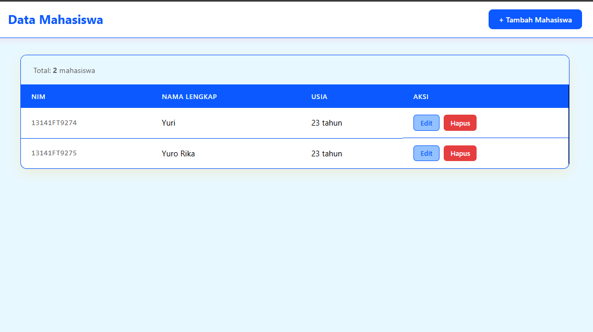

# CollegeStudent

Full-stack student management website with:

- **Backend**: ASP.NET Core Web API (`.NET 10`)
- **Frontend**: React + TypeScript + Vite
- **Database**: PostgreSQL (Docker)

## Features

- List all students
- Create student
- Update student
- Delete student

## 📸 Screenshots

### List All Students


### Create Student


### Update Student


### Delete Student


## Project Structure

```text
CollegeStudent/
├─ backend/
│  ├─ CollegeStudent.API/
│  ├─ CollegeStudent.Application/
│  ├─ CollegeStudent.Domain/
│  └─ CollegeStudent.Infrastructure/
├─ frontend/
└─ docker-compose.yml
```

## Prerequisites

Install these first:

- [.NET SDK 10](https://dotnet.microsoft.com/) (target framework `net10.0`)
- [Node.js](https://nodejs.org/) (LTS recommended)
- [Docker Desktop](https://www.docker.com/products/docker-desktop/)
- [Git](https://git-scm.com/)

## Quick Start (Local)

### 1) Start PostgreSQL

From project root:

```bash
docker compose up -d
```

Database config:

- Host: `localhost`
- Port: `5432`
- Database: `CollegeStudentDB`
- Username: `postgres`
- Password: `postgres`

### 2) Start Backend API

```bash
cd backend/CollegeStudent.API
dotnet restore
dotnet run
```

Backend URLs:

- API: `http://localhost:5185`
- Swagger: `http://localhost:5185/swagger`

### 3) Start Frontend

Open a new terminal:

```bash
cd frontend
npm install
npm run dev
```

Frontend URL:

- `http://localhost:5173`

## Access

After backend and frontend are running:

- Open `http://localhost:5173`
- Frontend calls API at `http://localhost:5185/api/student`

## API Endpoints

Base URL: `http://localhost:5185/api/student`

- `GET /api/student` — get all students
- `GET /api/student/{id}` — get student by ID
- `POST /api/student` — create student
- `PUT /api/student/{id}` — update student
- `DELETE /api/student/{id}` — delete student

### Sample Request Body (Create/Update)

```json
{
  "id": "1234567890",
  "namaDepan": "Budi",
  "namaBelakang": "Santoso",
  "tanggalLahir": "2004-01-15T00:00:00"
}
```

## Configuration

Development connection string file:

- `backend/CollegeStudent.API/appsettings.Development.json`

Default values match `docker-compose.yml`.

## Troubleshooting

- **Port 5432 already used**: change port mapping in `docker-compose.yml`.
- **Frontend cannot reach API**: ensure backend is running at `http://localhost:5185`.
- **CORS error**: frontend must run on `http://localhost:5173`.

